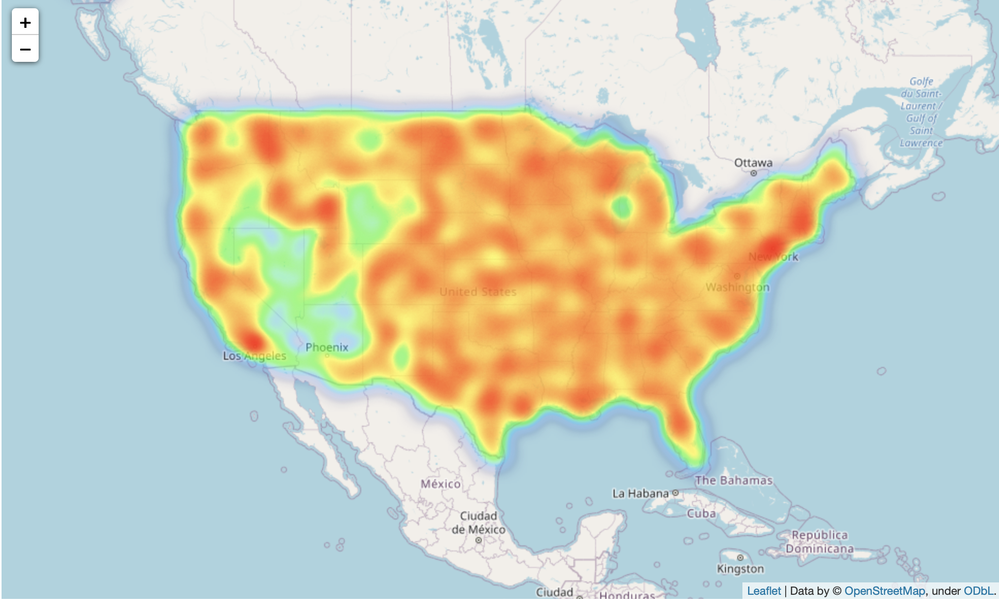
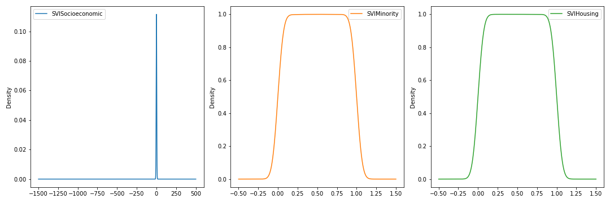
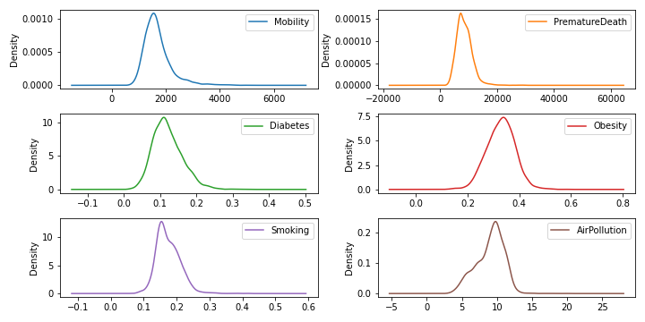
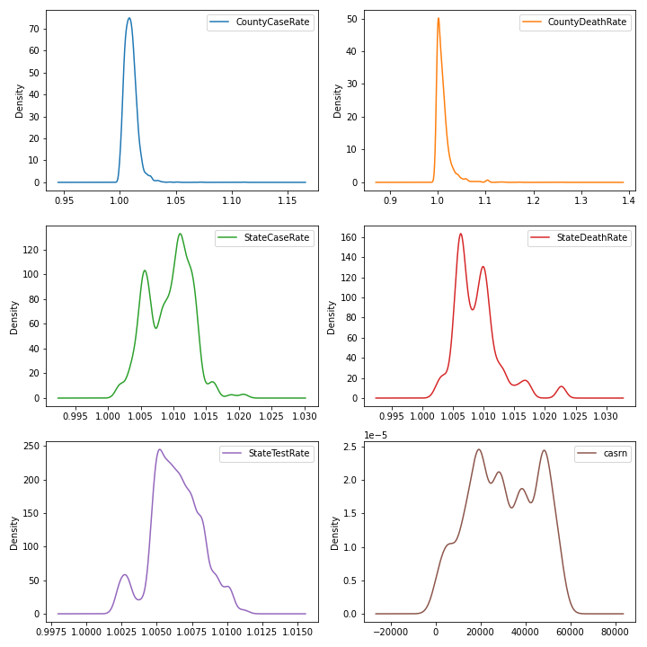

# Samuel Narvaez - Galvanize DSI Capstone 1

## Proposal:
### Exploring Composite Indicators via the CDC's Pandemic Vulnerability Index (PVI):
  [PVI dashboard](https://covid.cdc.gov/covid-data-tracker/#pandemic-vulnerability-index)
  
  [medRXiv Publication](https://www.medrxiv.org/content/10.1101/2020.08.10.20169649v3.full-text)

  [data source](https://github.com/COVID19PVI/data)
#### Abstract
I am interested in unpacking the data that go into the making of the Pandemic Vulnerability Index (PVI). The index is an aggregation of various indicators that are normalized and weighted as outlined [here](https://www.niehs.nih.gov/research/programs/coronavirus/covid19pvi/details/). The specific datasets (“components”) comprising the current PVI model were each assigned to an indicator (“data slice”) as part of four major domains: Infection Rate, Population Concentration, Intervention Measures, and Health & Environment. I will be looking at the source data and unpacking the components aggregated within the four major domains to better understand the choices made in creating the PVI using as a framework [steps](https://composite-indicators.jrc.ec.europa.eu/?q=10-step-guide) from the OECD's [Handbook on Constructing Composite Indicators](http://www.oecd.org/sdd/42495745.pdf):
* Step 1: Theoretical framework
* Step 2: Data selection
* Step 3: Imputation of missing data
* Step 4: Multivariate analysis
* Step 5: Normalisation
* Step 6: Weighting
* Step 7: Aggregating indicators
* Step 8: Sensitivity analysis
* Step 9: Link to other measures
* Step 10: Visualisation
#### Possible Visualizations
I think it could be interesting to choose a few days and compare the correlations between COVID deaths and all the individual variables that go into the PVI as well as the PVI itself AND correlations between COVID infections and all the individual variables that go into the PVI as well as the PVI itself.
#### Possible Hypotheses to test:
Could test to confirm that the PVI is a better predictor for COVID infections and deaths than any of the individual datapoints on their own

## Preliminary EDA:
#### Heatmap of Cases around the US on Jan 15, 2021:

#### Density of [SVI](https://www.atsdr.cdc.gov/placeandhealth/svi/index.html) measures Jan 15, 2021:

#### Density of environmental risk factors Jan 15, 2021:

#### Density of Infection/Death rates Jan 15, 2021:

